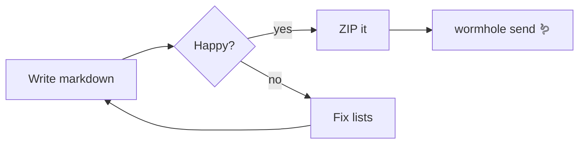

# Basalt ⛰️ — a tiny FOSS, Obsidian-flavored markdown vault

A plain Node.js web server (no framework madness, no build step, all MIT-licensed deps). Everything you asked for:

1. **Live split preview** — markdown renders as you type, images embed from links (plus paste/drop upload)
2. **Numbered-list fixer** — `1.` `5.` `9.` → rewritten to `1.` `2.` `3.` (button, `Ctrl+Shift+L`, or auto-fix on save). Note: *every* CommonMark renderer — Obsidian's preview included — ignores typed numbers and just counts items, which is why your `5.` showed as `3`. Basalt fixes the *source* to match.
3. **GFM tables**, **Mermaid diagrams**, **highlight.js code blocks** (190+ languages)
4. **ZIP export** + one-click send via the **magic-wormhole** CLI (streams the wormhole code into the UI)

## Project layout

```
basalt/
├── package.json
├── scripts/copy-vendor.js
├── server.js
├── render.js
├── templates/welcome.md
└── public/
    ├── index.html
    ├── css/style.css
    └── js/
        ├── fixlists.js
        └── app.js
```

#### `package.json`

```json
{
  "name": "basalt",
  "version": "1.0.0",
  "description": "A tiny FOSS, Obsidian-flavoured markdown vault. Node.js web server.",
  "main": "server.js",
  "license": "MIT",
  "engines": { "node": ">=16" },
  "scripts": {
    "postinstall": "node scripts/copy-vendor.js",
    "start": "node server.js",
    "dev": "node --watch server.js"
  },
  "dependencies": {
    "archiver": "^7.0.1",
    "codemirror": "^5.65.16",
    "express": "^4.19.2",
    "highlight.js": "^11.9.0",
    "marked": "^4.3.0",
    "mermaid": "^10.9.0"
  }
}
```

#### `scripts/copy-vendor.js`

Copies browser builds out of `node_modules` at install time — no CDN, fully offline.

```js
// Copies browser-ready files from node_modules into public/vendor
const fs = require("fs");
const path = require("path");

const nm = (...p) => path.join(__dirname, "..", "node_modules", ...p);
const out = path.join(__dirname, "..", "public", "vendor");

function copy(src, dest) {
  fs.mkdirSync(path.dirname(dest), { recursive: true });
  fs.copyFileSync(src, dest);
  console.log("vendored:", path.relative(process.cwd(), dest));
}

copy(nm("codemirror", "lib", "codemirror.js"),               out, "codemirror/codemirror.js");
copy(nm("codemirror", "lib", "codemirror.css"),              out, "codemirror/codemirror.css");
copy(nm("codemirror", "mode", "markdown", "markdown.js"),    out, "codemirror/mode-markdown.js");
copy(nm("codemirror", "mode", "javascript", "javascript.js"),out, "codemirror/mode-javascript.js");
copy(nm("codemirror", "mode", "xml", "xml.js"),              out, "codemirror/mode-xml.js");
copy(nm("codemirror", "addon", "edit", "continuelist.js"),   out, "codemirror/continuelist.js");
copy(nm("codemirror", "addon", "edit", "closebrackets.js"),  out, "codemirror/closebrackets.js");
copy(nm("codemirror", "addon", "selection", "active-line.js"), out, "codemirror/active-line.js");
copy(nm("codemirror", "addon", "display", "placeholder.js"), out, "codemirror/placeholder.js");
copy(nm("mermaid", "dist", "mermaid.min.js"),                out, "mermaid/mermaid.min.js");
copy(nm("highlight.js", "styles", "github-dark.css"),        out, "highlight/github-dark.css");

console.log("done.");
```

#### `server.js`

```js
#!/usr/bin/env node
/** Basalt — tiny FOSS markdown vault (Node + Express). MIT. */
const express = require("express");
const fs = require("fs");
const os = require("os");
const path = require("path");
const { execFile, spawn } = require("child_process");
const archiver = require("archiver");
const renderMarkdown = require("./render");
const fixOrderedLists = require("./public/js/fixlists");

const PORT = parseInt(process.env.PORT || "3000", 10);
const HOST = process.env.HOST || "127.0.0.1";
const NOTES_DIR = path.resolve(process.env.NOTES_DIR || path.join(__dirname, "notes"));
const ATTACHMENTS_DIR = path.join(NOTES_DIR, "attachments");

fs.mkdirSync(NOTES_DIR, { recursive: true });
fs.mkdirSync(ATTACHMENTS_DIR, { recursive: true });

// Seed an empty vault with a demo note
if (!fs.readdirSync(NOTES_DIR).some((f) => /\.md$/i.test(f))) {
  fs.writeFileSync(
    path.join(NOTES_DIR, "welcome.md"),
    fs.readFileSync(path.join(__dirname, "templates", "welcome.md"), "utf8")
  );
}

const app = express();
app.disable("x-powered-by");
app.use(express.json({ limit: "20mb" }));
app.use(express.static(path.join(__dirname, "public")));
app.use("/notes", express.static(NOTES_DIR)); // serves attachments & local images

/** Only bare *.md files directly inside NOTES_DIR (no path traversal). */
function safeName(name) {
  if (typeof name !== "string") return null;
  const base = path.basename(name);
  return /^[\w][\w ().,\-\[\]]*\.md$/i.test(base) ? base : null;
}

app.get("/api/files", (_req, res) => {
  try {
    const files = fs.readdirSync(NOTES_DIR, { withFileTypes: true })
      .filter((d) => d.isFile() && /\.md$/i.test(d.name))
      .map((d) => {
        const st = fs.statSync(path.join(NOTES_DIR, d.name));
        return { name: d.name, size: st.size, mtime: st.mtimeMs };
      })
      .sort((a, b) => b.mtime - a.mtime);
    res.json(files);
  } catch (e) { res.status(500).json({ error: e.message }); }
});

app.get("/api/file", (req, res) => {
  const name = safeName(req.query.name);
  if (!name) return res.status(400).json({ error: "Invalid file name" });
  const file = path.join(NOTES_DIR, name);
  if (!fs.existsSync(file)) return res.status(404).json({ error: "File not found" });
  res.type("text/plain; charset=utf-8").send(fs.readFileSync(file, "utf8"));
});

app.post("/api/file", (req, res) => {
  const name = safeName(req.body.name);
  if (!name) return res.status(400).json({ error: "Invalid file name (bare *.md, no slashes)" });
  const file = path.join(NOTES_DIR, name);
  if (fs.existsSync(file)) return res.status(409).json({ error: "File already exists" });
  fs.writeFileSync(file, String(req.body.content ?? ""));
  res.status(201).json({ ok: true, name });
});

app.put("/api/file", (req, res) => {
  const name = safeName(req.body.name);
  if (!name) return res.status(400).json({ error: "Invalid file name" });
  let content = typeof req.body.content === "string" ? req.body.content : "";
  if (req.body.fixLists) content = fixOrderedLists(content);
  fs.writeFileSync(path.join(NOTES_DIR, name), content);
  res.json({ ok: true, name, bytes: Buffer.byteLength(content, "utf8") });
});

app.delete("/api/file", (req, res) => {
  const name = safeName(req.query.name);
  if (!name) return res.status(400).json({ error: "Invalid file name" });
  const file = path.join(NOTES_DIR, name);
  if (!fs.existsSync(file)) return res.status(404).json({ error: "File not found" });
  fs.unlinkSync(file);
  res.json({ ok: true });
});

app.post("/api/render", (req, res) => {
  res.json({ html: renderMarkdown(String(req.body.markdown || "")) });
});

// Paste/drop image upload → attachments/
app.post("/api/upload", express.raw({ type: "*/*", limit: "30mb" }), (req, res) => {
  const name = String(req.query.name || "");
  if (!/^[\w.-]+$/.test(name)) return res.status(400).json({ error: "Invalid file name" });
  fs.writeFileSync(path.join(ATTACHMENTS_DIR, name), req.body);
  res.json({ ok: true, path: `attachments/${name}` });
});

// Download whole vault as zip
app.get("/api/export", (_req, res) => {
  const stamp = new Date().toISOString().slice(0, 10);
  res.setHeader("Content-Type", "application/zip");
  res.setHeader("Content-Disposition", `attachment; filename="basalt-vault-${stamp}.zip"`);
  const archive = archiver("zip", { zlib: { level: 9 } });
  archive.on("error", () => res.status(500).end());
  archive.pipe(res);
  archive.directory(NOTES_DIR, false);
  archive.finalize();
});

// Zip the vault and hand it to the magic-wormhole CLI; stream output (incl. the code) to the UI
let wormholeBusy = false;
app.get("/api/wormhole", (req, res) => {
  if (wormholeBusy) return res.status(409).type("text").send("A wormhole send is already in progress.");
  execFile("wormhole", ["--version"], { timeout: 8000 }, (err) => {
    if (err) {
      return res.status(500).type("text; charset=utf-8").send(
        "ERROR: the magic-wormhole CLI was not found on this machine.\n\nInstall it:\n" +
        "  pip/pipx install magic-wormhole | brew install magic-wormhole | apt install magic-wormhole\n\n" +
        "Meanwhile, the plain ZIP download (toolbar -> ZIP) always works."
      );
    }
    sendVault();
  });

  function sendVault() {
    const zipPath = path.join(os.tmpdir(), `basalt-vault-${Date.now()}.zip`);
    const archive = archiver("zip", { zlib: { level: 9 } });
    const out = fs.createWriteStream(zipPath);
    archive.on("error", (e) => finish(1, "zip error: " + e.message));
    archive.pipe(out);
    archive.directory(NOTES_DIR, false);
    archive.finalize();

    out.on("close", () => {
      wormholeBusy = true;
      const child = spawn("wormhole", ["send", zipPath], { stdio: ["ignore", "pipe", "pipe"] });
      res.setHeader("Content-Type", "text/plain; charset=utf-8");
      res.setHeader("Cache-Control", "no-cache");
      const fwd = (chunk) => { try { res.write(chunk.toString()); } catch { /* client gone */ } };
      child.stdout.on("data", fwd);
      child.stderr.on("data", fwd); // wormhole prints the code on stderr
      const onAbort = () => { try { child.kill("SIGTERM"); } catch {} };
      req.on("close", onAbort);
      child.on("close", (code) => {
        req.off("close", onAbort);
        wormholeBusy = false;
        fs.unlink(zipPath, () => {});
        finish(code);
      });
    });

    function finish(code, note) {
      try {
        if (note) res.write("\n" + note + "\n");
        res.end(`\n[wormhole exited with code ${code}]\n`);
      } catch {}
    }
  }
});

app.use("/api", (_req, res) => res.status(404).json({ error: "not found" }));

app.listen(PORT, HOST, () => {
  console.log(`\n  ⛰  Basalt running → http://localhost:${PORT}`);
  console.log(`     vault: ${NOTES_DIR}\n`);
});
```

#### `render.js`

```js
/** Markdown → HTML: GFM tables, mermaid passthrough, highlight.js code. */
const { marked } = require("marked");
const hljs = require("highlight.js");

function escapeHtml(s) {
  return String(s).replace(/&/g, "&amp;").replace(/</g, "&lt;")
    .replace(/>/g, "&gt;").replace(/"/g, "&quot;");
}

marked.setOptions({ gfm: true, breaks: true }); // breaks:true ≈ Obsidian's soft line breaks
marked.use({
  renderer: {
    // Handles both classic (code, infostring) and token-object renderer signatures
    code(codeOrToken, infostring) {
      let code, lang;
      if (codeOrToken && typeof codeOrToken === "object") {
        code = codeOrToken.text ?? "";
        lang = String(codeOrToken.lang || "").trim().split(/\s+/)[0];
      } else {
        code = String(codeOrToken ?? "");
        lang = String(infostring || "").trim().split(/\s+/)[0];
      }

      if (lang.toLowerCase() === "mermaid") {
        // Raw passthrough; the browser renders it with mermaid.js
        return `<pre class="mermaid-source"><code class="language-mermaid">${escapeHtml(code)}</code></pre>`;
      }
      if (lang && hljs.getLanguage(lang)) {
        let html;
        try { html = hljs.highlight(code, { language: lang, ignoreIllegals: true }).value; }
        catch { html = escapeHtml(code); }
        return `<pre><code class="hljs language-${escapeHtml(lang)}">${html}</code></pre>`;
      }
      let html;
      try { html = lang ? escapeHtml(code) : (code.length < 10000 ? hljs.highlightAuto(code).value : escapeHtml(code)); }
      catch { html = escapeHtml(code); }
      return `<pre><code class="hljs">${html}</code></pre>`;
    },
  },
});

module.exports = function renderMarkdown(md) {
  try {
    return marked.parse(md ?? "");
  } catch (e) {
    return `<p class="render-error">Render error: ${escapeHtml(e.message)}</p>`;
  }
};
```

#### `public/js/fixlists.js`

The numbered-list fixer. UMD, so the server and browser share it.

```js
/* Fix ordered-list numbering in markdown source.
 * "1. / 5. / 9." → "1. / 2. / 3." per list level, starting from each
 * list's first number. Preserves "." vs ")". Skips fenced code blocks.
 */
(function (root, factory) {
  if (typeof module === "object" && module.exports) module.exports = factory();
  else root.fixOrderedLists = factory();
})(typeof self !== "undefined" ? self : this, function () {
  "use strict";
  const FENCE_RE  = /^(\s*)(`{3,}|~{3,})/;
  const ITEM_RE   = /^(\s*)(\d{1,9})([.)])(\s|$)/;
  const BULLET_RE = /^(\s*)([-*+])(\s|$)/;

  function indentWidth(ws) {
    let w = 0;
    for (const c of ws) w += c === "\t" ? 4 - (w % 4) : 1;
    return w;
  }

  return function fixOrderedLists(md) {
    if (typeof md !== "string") return md;
    const lines = md.split(/\r?\n/);
    const out = [];
    const levels = []; // { indent, next, marker }
    let inFence = false, fenceChar = "", fenceLen = 0;

    for (const line of lines) {
      const fm = line.match(FENCE_RE);
      if (fm) {
        const ch = fm[2].charAt(0), len = fm[2].length;
        if (!inFence) { inFence = true; fenceChar = ch; fenceLen = len; }
        else if (ch === fenceChar && len >= fenceLen) inFence = false;
        out.push(line); continue;
      }
      if (inFence) { out.push(line); continue; }

      const om = line.match(ITEM_RE);
      if (om) {
        const ind = indentWidth(om[1]);
        while (levels.length && levels[levels.length - 1].indent > ind) levels.pop();
        if (!levels.length || levels[levels.length - 1].indent < ind) {
          levels.push({ indent: ind, next: parseInt(om[2], 10) + 1, marker: om[3] });
        } else {
          levels[levels.length - 1].marker = om[3];
        }
        const lvl = levels[levels.length - 1];
        const rest = line.slice(om[0].length);
        out.push(om[1] + (lvl.next - 1) + lvl.marker + (rest ? " " + rest : ""));
        continue;
      }

      const bm = line.match(BULLET_RE);
      if (bm) {
        const bind = indentWidth(bm[1]);
        while (levels.length && levels[levels.length - 1].indent >= bind) levels.pop();
        out.push(line); continue;
      }

      if (line.trim() === "") { out.push(line); continue; }
      const tind = indentWidth(line.match(/^\s*/)[0]);
      if (levels.length && tind < levels[levels.length - 1].indent + 2) levels.length = 0;
      out.push(line);
    }
    return out.join("\n");
  };
});
```

#### `public/index.html`

```html
<!doctype html>
<html lang="en">
<head>
<meta charset="utf-8">
<meta name="viewport" content="width=device-width, initial-scale=1">
<title>Basalt — markdown vault</title>
<link rel="stylesheet" href="/vendor/codemirror/codemirror.css">
<link rel="stylesheet" href="/vendor/highlight/github-dark.css">
<link rel="stylesheet" href="/css/style.css">
</head>
<body>
<header id="topbar">
  <div class="brand">⛰ Basalt</div>
  <button id="btn-new" title="New note">＋ New</button>
  <button id="btn-save" title="Save now (Ctrl+S)">Save</button>
  <button id="btn-fix" title="Fix ordered-list numbering (Ctrl+Shift+L)">Fix numbering</button>
  <button id="btn-bold" title="Bold (Ctrl+B)"><b>B</b></button>
  <button id="btn-italic" title="Italic (Ctrl+I)"><i>I</i></button>
  <button id="btn-code" title="Code block">&lt;/&gt;</button>
  <button id="btn-table" title="Insert table">Table</button>
  <button id="btn-preview" class="toggle on" title="Toggle preview">Preview</button>
  <span class="spacer"></span>
  <button id="btn-export" title="Download vault as .zip">⬇ ZIP</button>
  <button id="btn-wormhole" title="Zip + send via magic-wormhole">🪱 Wormhole</button>
</header>

<main>
  <aside id="sidebar"><ul id="filelist"></ul></aside>
  <section id="split">
    <div id="editor-pane"><textarea id="editor"></textarea></div>
    <div id="preview-pane"><article id="preview" class="markdown-body"></article></div>
  </section>
</main>

<footer id="statusbar">
  <span id="status">Ready</span>
  <span class="spacer"></span>
  <label class="chk" title="Rewrite ordered-list numbers to 1,2,3… every save">
    <input type="checkbox" id="chk-autofix" checked> auto-fix numbering on save
  </label>
  <span id="savestate"></span>
</footer>

<div id="wormhole-modal" class="modal hidden">
  <div class="modal-box">
    <h2>Send vault via Wormhole</h2>
    <p>Zips your notes and sends them with the <a href="https://magic-wormhole.readthedocs.io" target="_blank" rel="noopener">magic-wormhole</a> CLI (must be installed on this machine). Type the code on the receiving computer with <code>wormhole receive</code>.</p>
    <pre id="wormhole-log">Starting…</pre>
    <div id="wormhole-code" class="hidden"></div>
    <div class="modal-actions">
      <button id="wormhole-copy" class="hidden">Copy code</button>
      <button id="wormhole-cancel">Cancel</button>
    </div>
  </div>
</div>

<script src="/vendor/codemirror/codemirror.js"></script>
<script src="/vendor/codemirror/mode-markdown.js"></script>
<script src="/vendor/codemirror/mode-javascript.js"></script>
<script src="/vendor/codemirror/mode-xml.js"></script>
<script src="/vendor/codemirror/continuelist.js"></script>
<script src="/vendor/codemirror/closebrackets.js"></script>
<script src="/vendor/codemirror/active-line.js"></script>
<script src="/vendor/codemirror/placeholder.js"></script>
<script src="/vendor/mermaid/mermaid.min.js"></script>
<script src="/js/fixlists.js"></script>
<script src="/js/app.js"></script>
</body>
</html>
```

#### `public/js/app.js`

```js
/* global CodeMirror, mermaid, fixOrderedLists */
(function () {
  "use strict";
  const $ = (sel) => document.querySelector(sel);
  const preview = $("#preview");
  const previewPane = $("#preview-pane");
  const fileListEl = $("#filelist");
  const statusEl = $("#status");
  const saveEl = $("#savestate");
  const autofixChk = $("#chk-autofix");

  let currentFile = null;

  autofixChk.checked = localStorage.getItem("basalt-autofix") !== "0";
  autofixChk.addEventListener("change", () =>
    localStorage.setItem("basalt-autofix", autofixChk.checked ? "1" : "0"));

  /* ---------------- editor ---------------- */
  const cm = CodeMirror.fromTextArea($("#editor"), {
    mode: "markdown",
    lineNumbers: true,
    lineWrapping: true,
    autoCloseBrackets: true,
    styleActiveLine: true,
    fencedCodeBlockHighlighting: false,
    placeholder: "Start writing… (markdown, tables, ```mermaid blocks, paste images)",
    extraKeys: {
      "Enter": "newlineAndIndentContinueMarkdownList",
      "Ctrl-B": () => wrapSel("**"), "Cmd-B": () => wrapSel("**"),
      "Ctrl-I": () => wrapSel("*"),  "Cmd-I": () => wrapSel("*"),
      "Ctrl-K": insertLink, "Cmd-K": insertLink,
      "Ctrl-S": saveNow, "Cmd-S": saveNow,
      "Ctrl-Shift-L": fixLists, "Cmd-Shift-L": fixLists,
      "Tab": (c) => (c.somethingSelected() ? c.indentSelection("add") : c.replaceSelection("  ")),
      "Shift-Tab": (c) => c.indentSelection("subtract"),
    },
  });

  function wrapSel(marker) {
    const sel = cm.getSelection();
    cm.replaceSelection(marker + (sel || "text") + marker);
    if (!sel) {
      const cur = cm.getCursor();
      cm.setSelection({ line: cur.line, ch: cur.ch - marker.length - 4 },
                       { line: cur.line, ch: cur.ch - marker.length });
    }
    cm.focus();
  }
  function insertLink() {
    const sel = cm.getSelection() || "link text";
    cm.replaceSelection(`[${sel}](https://)`);
    const cur = cm.getCursor();
    cm.setSelection({ line: cur.line, ch: cur.ch - 9 }, { line: cur.line, ch: cur.ch - 1 });
    cm.focus();
  }
  function insertTable() {
    cm.replaceSelection("\n| Column A | Column B |\n| -------- | -------- |\n| cell     | cell     |\n");
    cm.focus();
  }
  function wrapCode() {
    const sel = cm.getSelection() || "code";
    cm.replaceSelection("```\n" + sel + "\n```\n");
    cm.focus();
  }

  /* ---------------- files ---------------- */
  async function loadFileList(selectName) {
    const files = await (await fetch("/api/files")).json();
    fileListEl.innerHTML = "";
    for (const f of files) {
      const li = document.createElement("li");
      li.textContent = f.name;
      li.dataset.name = f.name;
      if (f.name === currentFile) li.classList.add("active");
      li.addEventListener("click", () => openFile(f.name));
      const del = document.createElement("button");
      del.className = "mini"; del.textContent = "×"; del.title = "Delete " + f.name;
      del.addEventListener("click", async (e) => {
        e.stopPropagation();
        if (!confirm(`Delete “${f.name}”? This cannot be undone.`)) return;
        await fetch(`/api/file?name=${encodeURIComponent(f.name)}`, { method: "DELETE" });
        if (currentFile === f.name) { currentFile = null; cm.setValue(""); renderSoon(); }
        loadFileList();
      });
      li.appendChild(del);
      fileListEl.appendChild(li);
    }
    if (selectName) openFile(selectName);
    else if (!currentFile && files.length) openFile(files[0].name);
  }

  async function openFile(name) {
    await saveNow(); // flush previous file
    currentFile = name;
    cm.setValue(await (await fetch(`/api/file?name=${encodeURIComponent(name)}`)).text());
    [...fileListEl.children].forEach((li) => li.classList.toggle("active", li.dataset.name === name));
    renderSoon();
    setStatus("Opened " + name);
  }

  $("#btn-new").addEventListener("click", async () => {
    const raw = (prompt("New note name:", "untitled.md") || "").trim();
    if (!raw) return;
    const name = /\.md$/i.test(raw) ? raw : raw + ".md";
    const res = await fetch("/api/file", {
      method: "POST", headers: { "Content-Type": "application/json" },
      body: JSON.stringify({ name, content: "# " + name.replace(/\.md$/i, "") + "\n\n" }),
    });
    if (!res.ok) return alert((await res.json()).error);
    currentFile = name;
    loadFileList(name);
  });

  /* ---------------- save / fix ---------------- */
  let saveTimer = null, renderTimer = null;
  const scheduleSave = () => { clearTimeout(saveTimer); saveTimer = setTimeout(saveNow, 800); };
  const renderSoon   = () => { clearTimeout(renderTimer); renderTimer = setTimeout(renderPreview, 200); };

  cm.on("change", () => { saveEl.textContent = "…"; scheduleSave(); renderSoon(); });

  function setDoc(text) {
    const cur = cm.getCursor(), sc = cm.getScrollInfo();
    cm.setValue(text);
    cm.setCursor(cur); cm.scrollTo(sc.left, sc.top);
  }

  async function saveNow() {
    clearTimeout(saveTimer);
    if (!currentFile) return;
    let content = cm.getValue();
    if (autofixChk.checked) {
      const fixed = fixOrderedLists(content);
      if (fixed !== content) { content = fixed; setDoc(fixed); }
    }
    const res = await fetch("/api/file", {
      method: "PUT", headers: { "Content-Type": "application/json" },
      body: JSON.stringify({ name: currentFile, content }),
    });
    saveEl.textContent = res.ok ? "saved " + new Date().toLocaleTimeString() : "save FAILED";
  }

  function fixLists() {
    const fixed = fixOrderedLists(cm.getValue());
    if (fixed !== cm.getValue()) {
      setDoc(fixed);
      setStatus("List numbering fixed ✓");
      saveNow(); renderSoon();
    } else setStatus("List numbering already sequential ✓");
  }

  $("#btn-save").addEventListener("click", saveNow);
  $("#btn-fix").addEventListener("click", fixLists);
  $("#btn-bold").addEventListener("click", () => wrapSel("**"));
  $("#btn-italic").addEventListener("click", () => wrapSel("*"));
  $("#btn-code").addEventListener("click", wrapCode);
  $("#btn-table").addEventListener("click", insertTable);
  $("#btn-export").addEventListener("click", () => {
    const a = document.createElement("a");
    a.href = "/api/export"; a.download = ""; a.click();
  });
  $("#btn-preview").addEventListener("click", () => {
    const off = document.body.classList.toggle("no-preview");
    $("#btn-preview").classList.toggle("on", !off);
  });

  /* ---------------- live preview ---------------- */
  async function renderPreview() {
    try {
      const res = await fetch("/api/render", {
        method: "POST", headers: { "Content-Type": "application/json" },
        body: JSON.stringify({ markdown: cm.getValue() }),
      });
      const { html } = await res.json();
      preview.innerHTML = html;

      // resolve relative images (attachments) against /notes, open external links in new tab
      preview.querySelectorAll("img").forEach((img) => {
        const src = img.getAttribute("src") || "";
        if (!/^(https?:|data:|\/|#)/i.test(src)) img.setAttribute("src", "/notes/" + src);
      });
      preview.querySelectorAll('a[href^="http"]').forEach((a) => { a.target = "_blank"; a.rel = "noopener"; });

      renderMermaid();
      updateCounts();
    } catch {
      preview.innerHTML = '<p class="render-error">render failed</p>';
    }
  }

  let mermaidInit = false;
  async function renderMermaid() {
    if (!window.mermaid) return;
    if (!mermaidInit) {
      mermaid.initialize({ startOnLoad: false, securityLevel: "loose", theme: "dark" });
      mermaidInit = true;
    }
    const blocks = preview.querySelectorAll("pre.mermaid-source > code.language-mermaid");
    blocks.forEach((code) => {
      const div = document.createElement("div");
      div.className = "mermaid";
      div.textContent = code.textContent;
      code.parentElement.replaceWith(div);
    });
    if (blocks.length) {
      try { await mermaid.run({ nodes: [...preview.querySelectorAll("div.mermaid:not([data-processed])")] }); }
      catch (e) { console.warn("mermaid:", e); }
    }
  }

  function updateCounts() {
    const text = cm.getValue();
    const words = (text.match(/\S+/g) || []).length;
    statusEl.textContent = `${currentFile || "no file"} · ${words} words · ${text.length} chars`;
  }

  /* ---------------- scroll sync ---------------- */
  let scrollLock = null;
  cm.on("scroll", () => {
    if (scrollLock === "preview") return;
    scrollLock = "editor";
    const si = cm.getScrollInfo();
    const max = Math.max(1, si.height - si.clientHeight);
    previewPane.scrollTop = (si.top / max) * Math.max(1, previewPane.scrollHeight - previewPane.clientHeight);
    requestAnimationFrame(() => { scrollLock = null; });
  });
  previewPane.addEventListener("scroll", () => {
    if (scrollLock === "editor") return;
    scrollLock = "preview";
    const el = previewPane, si = cm.getScrollInfo();
    const max = Math.max(1, el.scrollHeight - el.clientHeight);
    cm.scrollTo(0, (el.scrollTop / max) * Math.max(1, si.height - si.clientHeight));
    requestAnimationFrame(() => { scrollLock = null; });
  });

  /* ---------------- image paste / drop ---------------- */
  const editorPane = $("#editor-pane");
  ["dragover", "drop"].forEach((ev) => editorPane.addEventListener(ev, (e) => e.preventDefault()));
  editorPane.addEventListener("drop", (e) => handleFiles(e.dataTransfer.files));
  cm.getWrapperElement().addEventListener("paste", (e) => {
    if (e.clipboardData?.files?.length) { e.preventDefault(); handleFiles(e.clipboardData.files); }
  });

  async function handleFiles(files) {
    for (const file of files) {
      if (!file.type.startsWith("image/")) continue;
      const ext = (file.name.match(/\.[a-z0-9]+$/i) || [".png"])[0];
      const base = (currentFile || "note").replace(/\.md$/i, "").replace(/[^\w.-]+/g, "-");
      const name = `${base}-${Date.now()}${ext}`;
      setStatus("Uploading " + file.name + "…");
      const res = await fetch(`/api/upload?name=${encodeURIComponent(name)}`, { method: "POST", body: file });
      if (!res.ok) { setStatus("Upload failed ✗"); continue; }
      const data = await res.json();
      cm.replaceSelection(`\n`);
      cm.focus();
      setStatus("Image embedded: " + data.path);
    }
  }

  /* ---------------- wormhole ---------------- */
  const modal = $("#wormhole-modal"), log = $("#wormhole-log"),
        codeBox = $("#wormhole-code"), copyBtn = $("#wormhole-copy");
  let whController = null;

  $("#btn-wormhole").addEventListener("click", startWormhole);
  $("#wormhole-cancel").addEventListener("click", () => {
    if (whController) whController.abort();
    modal.classList.add("hidden");
  });
  copyBtn.addEventListener("click", () => navigator.clipboard.writeText(codeBox.textContent.trim()));

  async function startWormhole() {
    modal.classList.remove("hidden");
    log.textContent = "Zipping vault and calling wormhole…\n";
    codeBox.classList.add("hidden"); copyBtn.classList.add("hidden");
    whController = new AbortController();
    try {
      const res = await fetch("/api/wormhole", { signal: whController.signal });
      const text = await readStream(res.body);
      if (!res.ok) log.textContent = text + "\n\nMake sure the magic-wormhole CLI is installed (see README).";
    } catch (e) {
      log.textContent += e.name === "AbortError" ? "\n[cancelled]" : "\n[error: " + e.message + "]";
    }
  }

  async function readStream(body) {
    const reader = body.getReader(), dec = new TextDecoder();
    let text = "";
    for (;;) {
      const { done, value } = await reader.read();
      if (done) break;
      text += dec.decode(value, { stream: true });
      log.textContent = text;
      log.scrollTop = log.scrollHeight;
      const m = text.match(/\b\d+(?:-[a-z0-9]+){2,}\b/i); // e.g. 7-crossover-clockwork
      if (m) {
        codeBox.textContent = "🔑 " + m[0];
        codeBox.classList.remove("hidden");
        copyBtn.classList.remove("hidden");
      }
    }
    return text;
  }

  /* ---------------- init ---------------- */
  function setStatus(msg) { statusEl.textContent = msg; }
  loadFileList();
})();
```

#### `public/css/style.css`

```css
:root {
  --bg: #1b1b1f; --bg-2: #222227; --bg-3: #2b2b31; --border: #38383f;
  --fg: #dcdee3; --muted: #9b9ba6;
  --accent: #a88bfa; --accent-2: #7aa2f7; --ok: #86c98f; --err: #e06c75;
  --mono: ui-monospace, "Cascadia Code", "JetBrains Mono", Consolas, monospace;
}
* { box-sizing: border-box; }
html, body { height: 100%; }
body { margin: 0; display: flex; flex-direction: column; background: var(--bg); color: var(--fg);
  font: 14px/1.55 system-ui, -apple-system, "Segoe UI", sans-serif; }

#topbar { display: flex; align-items: center; gap: 8px; padding: 8px 12px; background: var(--bg-2);
  border-bottom: 1px solid var(--border); flex-wrap: wrap; }
.brand { font-weight: 700; letter-spacing: .04em; color: var(--accent); margin-right: 8px; }
button { background: var(--bg-3); color: var(--fg); border: 1px solid var(--border); border-radius: 6px;
  padding: 5px 10px; font-size: 13px; cursor: pointer; }
button:hover { border-color: var(--accent); }
button.toggle.on { background: var(--accent); border-color: var(--accent); color: #17171a; font-weight: 600; }
button.mini { padding: 0 6px; border: none; background: transparent; color: var(--muted); font-size: 14px; }
button.mini:hover { color: var(--err); }
.spacer { flex: 1; }

main { flex: 1; display: flex; min-height: 0; }
#sidebar { width: 230px; background: var(--bg-2); border-right: 1px solid var(--border); overflow-y: auto; padding: 6px; }
#filelist { list-style: none; margin: 0; padding: 0; }
#filelist li { display: flex; align-items: center; justify-content: space-between; gap: 4px; padding: 6px 8px;
  border-radius: 6px; cursor: pointer; color: var(--muted); white-space: nowrap; overflow: hidden; }
#filelist li:hover { background: var(--bg-3); color: var(--fg); }
#filelist li.active { background: var(--bg-3); color: var(--accent); }
#split { flex: 1; display: flex; min-width: 0; }
#editor-pane, #preview-pane { flex: 1; min-width: 0; display: flex; flex-direction: column; }
#editor-pane { border-right: 1px solid var(--border); }
body.no-preview #preview-pane { display: none; }
#preview-pane { overflow-y: auto; padding: 18px 26px; }
#preview { max-width: 860px; margin: 0 auto; }

.CodeMirror { height: 100%; background: var(--bg); color: var(--fg); font-family: var(--mono);
  font-size: 14px; line-height: 1.65; }
.CodeMirror-gutters { background: var(--bg); border-right: 1px solid var(--border); }
.CodeMirror-linenumber { color: #55555e; }
.CodeMirror-cursor { border-left: 2px solid var(--accent); }
.CodeMirror-selected { background: rgba(136,136,255,.18); }
.CodeMirror-activeline-background { background: rgba(255,255,255,.035); }
.CodeMirror-placeholder { color: #5a5a66; }
span.cm-header { color: var(--accent-2); font-weight: 700; }
span.cm-string { color: #9ece6a; }
span.cm-link { color: var(--accent); }
span.cm-url { color: #6b7394; }
span.cm-quote { color: #8fa876; }
span.cm-hr, span.cm-comment { color: #5d6789; }
span.cm-em { font-style: italic; }
span.cm-strong { font-weight: 700; }

#preview h1, #preview h2 { border-bottom: 1px solid var(--border); padding-bottom: .25em; line-height: 1.25; }
#preview code { background: var(--bg-3); border-radius: 4px; padding: 2px 5px; font-family: var(--mono); font-size: .88em; }
#preview pre { background: #141417; border: 1px solid var(--border); border-radius: 8px; padding: 12px 14px; overflow: auto; }
#preview pre code { background: none; padding: 0; }
#preview blockquote { margin: 0; padding: 2px 14px; border-left: 3px solid var(--accent);
  color: var(--muted); background: rgba(168,139,250,.06); }
#preview table { border-collapse: collapse; margin: 1em 0; }
#preview th, #preview td { border: 1px solid var(--border); padding: 6px 12px; }
#preview th { background: var(--bg-2); }
#preview tr:nth-child(2n) td { background: rgba(255,255,255,.025); }
#preview img { max-width: 100%; border-radius: 6px; }
#preview a { color: var(--accent-2); }
#preview hr { border: none; border-top: 1px solid var(--border); }
#preview .mermaid { background: var(--bg-2); border: 1px solid var(--border); border-radius: 8px;
  padding: 10px; display: flex; justify-content: center; }
#preview pre.mermaid-source { color: var(--muted); }
.render-error { color: var(--err); }

#statusbar { display: flex; align-items: center; gap: 14px; padding: 5px 12px; background: var(--bg-2);
  border-top: 1px solid var(--border); color: var(--muted); font-size: 12px; }
#savestate { color: var(--ok); }
.chk { display: flex; align-items: center; gap: 5px; cursor: pointer; }

.hidden { display: none !important; }
.modal { position: fixed; inset: 0; background: rgba(0,0,0,.55); display: flex; align-items: center;
  justify-content: center; z-index: 50; }
.modal-box { width: min(640px, 92vw); background: var(--bg-2); border: 1px solid var(--border);
  border-radius: 10px; padding: 18px 20px; }
.modal-box h2 { margin: 0 0 8px; color: var(--accent); }
#wormhole-log { background: #141417; border: 1px solid var(--border); border-radius: 8px; padding: 10px;
  max-height: 200px; overflow: auto; white-space: pre-wrap; font-family: var(--mono); font-size: 12px; }
#wormhole-code { margin: 12px 0 4px; font-family: var(--mono); font-size: 20px; font-weight: 700; color: var(--ok); }
.modal-actions { display: flex; justify-content: flex-end; gap: 8px; margin-top: 12px; }

@media (max-width: 820px) { #sidebar { display: none; } }
```

#### `templates/welcome.md`

````markdown
# Welcome to Basalt ⛰️

A tiny, FOSS, Obsidian-flavoured markdown vault that runs as a **Node.js web server**.

## Images — from links, paste, or drop


Paste or drop an image straight into the editor — it lands in `attachments/` and the link is inserted for you.

## Tables

| Feature        | Status | Notes                       |
| -------------- | ------ | --------------------------- |
| Live preview   | ✅     | split view, synced scroll   |
| Tables         | ✅     | GFM pipe tables             |
| Mermaid        | ✅     | ` ```mermaid ` fenced blocks|
| Code highlight | ✅     | highlight.js, 190+ langs    |
| ZIP + Wormhole | ✅     | toolbar, top right          |

## Mermaid graphs



## Code highlighting

```js
// Everything autosaves — but Ctrl+S works too.
const vault = require("./server");
vault.listen(3000, () => console.log("notes at http://localhost:3000"));
```

```python
def hello():
    return "hi from a fenced python block"
```

## Numbered lists (the fun part)

Type the numbers in any wrong order you like:

1. first
2. second
3. third
   4. nested
   5. nested too
6. fourth

> The preview *always* shows them as 1, 2, 3… — every CommonMark renderer (including Obsidian's)
> renumbers lists and ignores what you typed. Hit **Fix numbering** in the toolbar (or
> `Ctrl+Shift+L`) to rewrite the *source* to 1, 2, 3… so editing and preview agree.
> Pressing **Enter** inside a list automatically continues it with the next number.

## Send your vault anywhere

Toolbar → **🪱 Wormhole** zips the vault and gives you a one-time code via
[magic-wormhole](https://magic-wormhole.readthedocs.io). Or just hit **⬇ ZIP** to download it.

Happy writing!
````

## Run it

```sh
mkdir basalt && cd basalt
# …save the files above…
npm install     # postinstall copies browser builds from node_modules
npm start       # → http://localhost:3000
```

- Notes live in `./notes/` — change with `NOTES_DIR=/path/to/vault npm start`
- Expose on your LAN: `HOST=0.0.0.0 PORT=3000 npm start` (no auth — keep it off the public internet)
- **Wormhole**: install the CLI once (`pip install magic-wormhole`, `brew install magic-wormhole`, or `apt install magic-wormhole`). The Wormhole button then zips the vault, runs `wormhole send`, and shows the code in a modal; Cancel kills the transfer. The ZIP button works without it.

## Notes & next steps

- Rendering happens **server-side** (marked + highlight.js) and mermaid client-side — one source of truth, no bundler needed.
- The list fixer only rewrites numbers on lines that are already ordered items, and skips fenced code blocks.
- Sensible forks: `[[wiki-links]]` + backlink pane, folder tree, `POST /api/wormhole` accepting a receiver, or websockets instead of debounced autosave. The API is tiny enough to extend in an afternoon.

Want me to add any of those (wiki-links are the most Obsidian-like next step), or package it as a single `npx basalt-serve` runnable?
