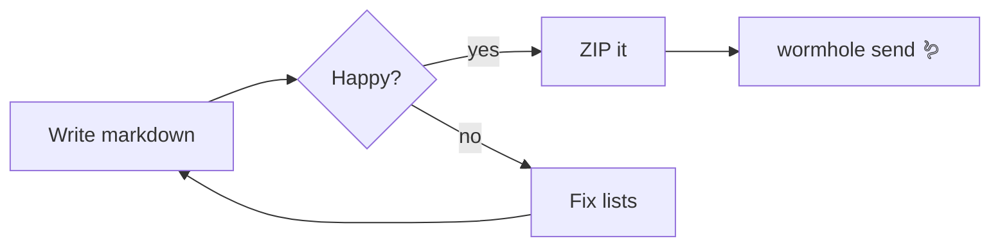

# Welcome to Basalt ⛰️

A tiny, FOSS, Obsidian-flavoured markdown vault that runs as a **Node.js web server**.

## Images — from links, paste, or drop


Paste or drop an image straight into the editor — it lands in `attachments/` and the link is inserted for you.

## Tables

| Feature        | Status | Notes                       |
| -------------- | ------ | --------------------------- |
| Live preview   | ✅     | split view, synced scroll   |
| Tables         | ✅     | GFM pipe tables             |
| Mermaid        | ✅     | ` ```mermaid ` fenced blocks|
| Code highlight | ✅     | highlight.js, 190+ langs    |
| ZIP + Wormhole | ✅     | toolbar, top right          |

## Mermaid graphs



## Code highlighting

```js
// Everything autosaves — but Ctrl+S works too.
const vault = require("./server");
vault.listen(3000, () => console.log("notes at http://localhost:3000"));
```

```python
def hello():
    return "hi from a fenced python block"
```

## Numbered lists (the fun part)

Type the numbers in any wrong order you like:

1. first
2. second
3. third
   4. nested
   5. nested too
6. fourth

> The preview *always* shows them as 1, 2, 3… — every CommonMark renderer (including Obsidian's)
> renumbers lists and ignores what you typed. Hit **Fix numbering** in the toolbar (or
> `Ctrl+Shift+L`) to rewrite the *source* to 1, 2, 3… so editing and preview agree.
> Pressing **Enter** inside a list automatically continues it with the next number.

## Send your vault anywhere

Toolbar → **🪱 Wormhole** zips the vault and gives you a one-time code via
[magic-wormhole](https://magic-wormhole.readthedocs.io). Or just hit **⬇ ZIP** to download it.

Happy writing!
